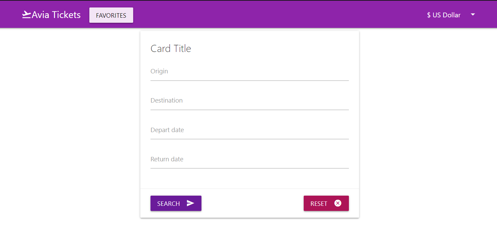
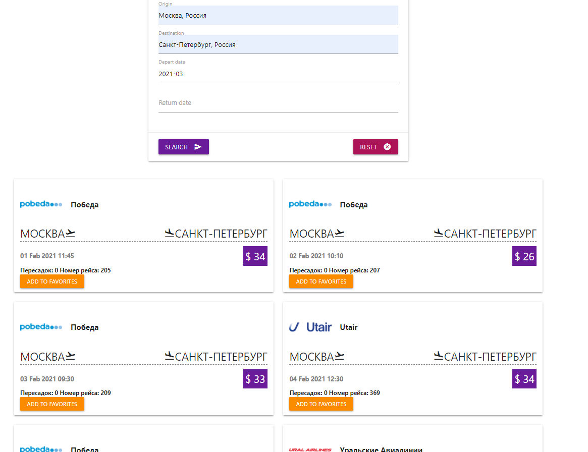
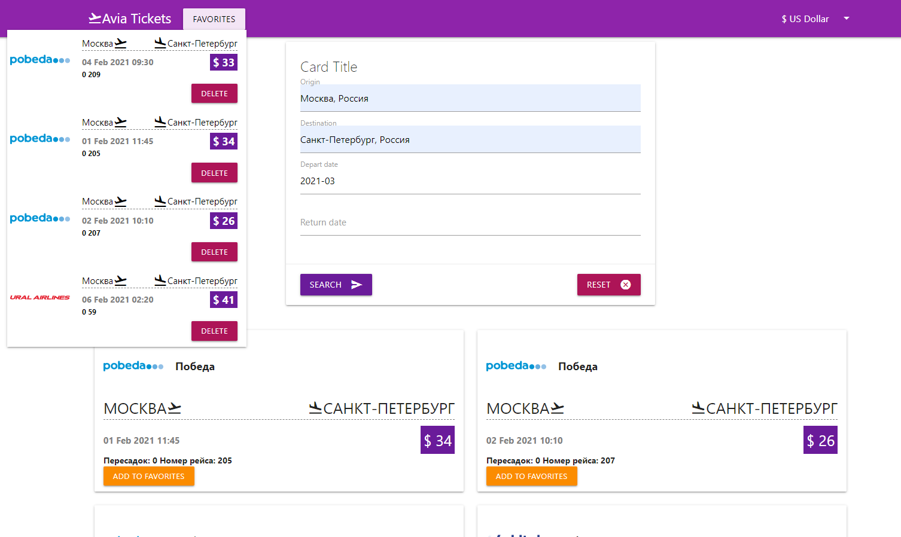

# Avia-tickets
> An app  to search for plane tickets by the required direction and date using free API and ajax requests

## Table of contents
* [General info](#general-info)
* [Screenshots](#screenshots)
* [Technologies](#technologies)
* [Setup](#setup)
* [Features](#features)
* [Status](#status)

## General info
I decided to practice using webpack and modular structure, js-classes, ajax requests(axios). 
Also I tried the Materialize framework (which I don't recommend using).

## Screenshots

## Technologies
* axios: 0.21.1
* date-fns: 2.16.1
* materialize-css: 1.0.0-rc.2 _(kinda out-of-date, I know)_

## Setup
[GitHub pages](https://ic3top.github.io/Avia-tickets/dist/)

## Features
###### List of features ready and TODOs for future development
* Search for tickets
* Set currency
* Add to favourites
* Local storage saves favourites

To-do list:
* Add toasts messages
* Change '_add to favourites_' button on click
* Improve dropdown (favourites)

## Status
Project is: _in progress_(require some improvements)
